

# SE-Assignment-4
Assignment: GitHub and Visual Studio
Instructions:
Answer the following questions based on your understanding of GitHub and Visual Studio. Provide detailed explanations and examples where appropriate.

Questions:
Introduction to GitHub:

1. What is GitHub, and what are its primary functions and features? Explain how it supports collaborative software development.
Repositories on GitHub:

2. What is a GitHub repository? Describe how to create a new repository and the essential elements that should be included in it.
Version Control with Git:

3. Explain the concept of version control in the context of Git. How does GitHub enhance version control for developers?
Branching and Merging in GitHub:

4. What are branches in GitHub, and why are they important? Describe the process of creating a branch, making changes, and merging it back into the main branch.
Pull Requests and Code Reviews:

5. What is a pull request in GitHub, and how does it facilitate code reviews and collaboration? Outline the steps to create and review a pull request.
GitHub Actions:

6. Explain what GitHub Actions are and how they can be used to automate workflows. Provide an example of a simple CI/CD pipeline using GitHub Actions.
Introduction to Visual Studio:

7. What is Visual Studio, and what are its key features? How does it differ from Visual Studio Code?
Integrating GitHub with Visual Studio:

8. Describe the steps to integrate a GitHub repository with Visual Studio. How does this integration enhance the development workflow?
Debugging in Visual Studio:

9. Explain the debugging tools available in Visual Studio. How can developers use these tools to identify and fix issues in their code?
Collaborative Development using GitHub and Visual Studio:

10. Discuss how GitHub and Visual Studio can be used together to support collaborative development. Provide a real-world example of a project that benefits from this integration.

Submission Guidelines:
Your answers should be well-structured, concise, and to the point.
Provide real-world examples or case studies wherever possible.
Cite any references or sources you use in your answers.
Submit your completed assignment by [due date].

ANSWERS:

Question 1: Introduction to GitHub:

GitHub is a web-based platform that utilizes Git, a distributed version control system, to facilitate software development and collaboration. GitHub provides a suite of tools and features that enhance version control, project management, and collaborative workflows. Below, I will elaborate on the primary functions and features of GitHub and explain how it supports collaborative software development.

Primary Functions and Features of GitHub:

1. Version Control:
    GitHub uses Git to manage and track changes in the source code. It allows developers to maintain a history of changes, revert to previous versions, and manage branches.

    Example: Developers can use git commit to save changes and git log to view the history of commits. The commands below can be used to do this:

    git commit -m "Fix bug in user login"
    git log

2. Repositories:
    A repository (repo) is a central place where the codebase and related assets are stored. Repositories can be public or private, allowing control over who can view or contribute to the project.

    For Example: Creating a new repository from the GitHub dashboard. 

3. Branching and Merging:
    Branches allow developers to work on different features or bug fixes simultaneously without affecting the main codebase. Merging integrates changes from different branches.

    For Example: Creating a new branch and merging it. The commands below can be used to do this:

    git checkout -b feature-branch
    git merge feature-branch

4. Pull Requests:
    Pull requests are a mechanism for proposing changes to the codebase. They allow team members to review and discuss the changes before merging them into the main branch.
    
    For Example: Opening a pull request for code review. 

5. Issues and Project Management:
    GitHub Issues are used to track bugs, enhancements, and tasks. Projects and boards provide a visual way to manage and organize issues, making it easier to follow the development progress.

6. Continuous Integration and Deployment (CI/CD):
    GitHub integrates with CI/CD tools to automate the testing and deployment process. GitHub Actions allow users to create workflows that build, test, and deploy code automatically.

7. Collaboration and Community:
    GitHub fosters collaboration through features like code reviews, discussions, and wikis. It also hosts open-source projects, allowing developers worldwide to contribute and learn from each other.

    For Example: Contributing to an open-source project via pull requests and discussions.

How GitHub Supports Collaborative Software Development:

GitHub plays a huge role in mantaining open-source projects. GitHub may have hundreds of contributors from around the world. Contributors create branches, make changes, and submit pull requests. Project maintainers review these pull requests, discuss potential improvements, and merge the changes. Additionally, it's also benefitial to software development teams working in corporations. These teams can use GitHub to manage their project. 

GitHub can help manage projects in the following ways:

1. Centralized Codebase:
    GitHub provides a centralized repository where all team members can access the latest version of the code, ensuring that everyone is working with the same codebase.

2. Branching and Parallel Development:
    Developers can create branches to work on new features or fixes independently. This enables parallel development and reduces the risk of conflicts.

3. Code Reviews and Quality Assurance:
    Pull requests enable peer reviews, ensuring that code is scrutinized before it is merged into the main branch. This improves code quality and fosters knowledge sharing among team members.

4. Issue Tracking and Project Management:
    GitHub Issues and Projects help teams track progress, manage tasks, and prioritize work. This ensures that everyone is aware of what needs to be done and can collaborate effectively.

5. Automated Workflows:

    GitHub Actions automate repetitive tasks such as testing and deployment. This speeds up the development process and ensures consistency in code quality.

6. Community Engagement:
    For open-source projects, GitHub provides a platform for engaging with the community. Contributors can submit issues, suggest enhancements, and contribute code, fostering a collaborative environment.

QUESTION 2: Repositories on GitHub

What is a GitHub Repository?
    A GitHub repository is a storage space where your project's files and revision history are managed. It is a central place to organize and track the development of a software project. GitHub repositories leverage Git's version control features, allowing multiple developers to collaborate, manage changes, and maintain a comprehensive history of the project's evolution.

Key Features of a GitHub Repository:

- Version Control: Tracks changes to files and maintains a history of revisions.

- Collaboration: Facilitates contributions from multiple developers through branches, pull requests, and code reviews.

- Issue Tracking: Manages bugs, enhancements, and tasks using GitHub Issues.

- Documentation: Supports README files, wikis, and other documentation tools.

- Project Management: Uses GitHub Projects and Milestones to organize and plan the project's workflow.

How to Create a New Repository:

Creating a repository on GitHub is a straightforward process. Below are the steps to create a new repository and the essential elements that should be included in it.

Step-by-Step Guide to Creating a New Repository:

1. Sign in to GitHub:

2. Go to GitHub and log in with your account credentials.

3. In the upper-right corner of any page, select , then click New repository.

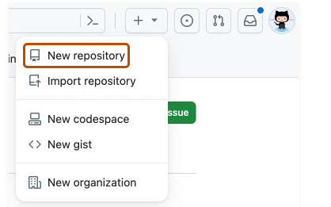

4. Click on the "New repository" button to start creating a new repository.

5. Fill in Repository Details:

- Repository Name: Choose a name for your repository.
- Description: (Optional) Provide a brief description of the repository.
- Visibility: Choose between Public (visible to everyone) or Private (visible only to you and your collaborators).

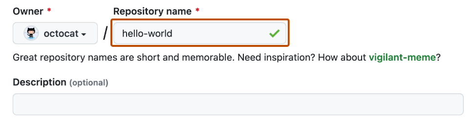

6. Initialize the Repository:
Initialize the Repository:
Optionally, you can initialize the repository with a README file, which is a markdown file providing an overview of your project.
You can also add a .gitignore file to specify which files should be ignored by Git, and a license file to define the licensing terms of your project.

7. Create Repository:
Click the "Create repository" button to finalize the creation process

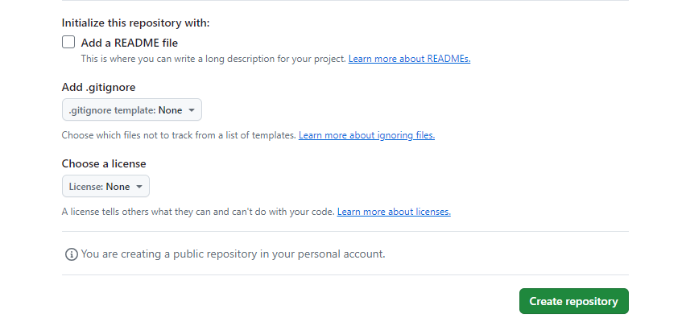

Essential Elements of a GitHub Repository:

1. README File:
A README.md file provides a detailed description of your project, including what it does, how to install and use it, and any other relevant information. It's often the first file a visitor will look at. 

Here is an example of the contents of a README.md file:

    ## My Project:
    This project is a sample application to demonstrate GitHub repository setup.
    ## Installation:
    git clone https://github.com/username/repository-name.git
    cd repository-name

2. .gitignore File:
A .gitignore file specifies which files and directories to ignore in the repository. This prevents sensitive or unnecessary files from being tracked by Git.

Here is an example of the contents of a README.md file:

    # Ignore node_modules folder
    node_modules/
    # Ignore logs
    *.log

3. LICENSE File:
A LICENSE file defines the legal licensing terms for your project. This is important for open-source projects to specify how others can use your code.

Question 3: Version Control with Git

Git allows developers to track changes, revert to previous stages, and work on different branches independently. Therefore, Git works as a version control system because it can record changes to a file or set of files over time so that specific versions can be recalled later. Git uses a distributed system, where the developer has a local copy of the entire project history, not just the current state. This ensures that operations like commits, diffs, and logs are fast and can be done offline. Git also encourages workflows that support experimentation and rapid prototyping by making branch creation, merging, and deletion straightforward and efficient.

How Git Works
Git's Local Repository comprises of:
- Working Directory: Where your files are checked out and modified.

- Staging Area: Where changes are staged for the next commit.

- Git Directory (.git): Where Git stores the metadata and object database for your project.

The Basic Workflow in Git:
- Clone: it copies a repository to your local machine.

- Add: it stages changes for commit.

- Commit: it saves snapshots of the project's staged changes.

- Push: it uploads local commits to a remote repository.

- Pull: it fetches and merges changes from the remote repository to your local repository.

Enhancing Version Control with GitHub:

GitHub is a cloud-based platform that uses Git for version control. It adds collaborative features and integrations that enhance the Git experience for developers. Here’s how GitHub improves version control:

1. Collaboration:
 - Pull Requests: Allow developers to discuss and review code before merging it into the main branch. This ensures code quality and facilitates knowledge sharing.

 - Issues: Track bugs, enhancements, and tasks. They serve as a communication tool for developers to manage project work.

2. Hosting and Distribution:
 - Repositories: GitHub hosts your repositories in the cloud, making them accessible from anywhere. Public repositories can be viewed by anyone, fostering open-source contributions.

3. Continuous Integration and Deployment (CI/CD):
 - Integrates with tools like GitHub Actions to automate testing, building, and deployment processes, ensuring that code changes meet quality standards before they are merged.

4. Social Coding:
 - Forking: Allows users to create a copy of a repository to work on without affecting the original project. Contributions can be made via pull requests.

 - Stars and Watchers: Enable users to bookmark repositories and stay updated on project developments.

5. Documentation and Wikis:

 - GitHub supports Markdown for README files, wikis for detailed project documentation, and GitHub Pages for hosting static websites.

QUESTION 4: Branching and Merging in GitHub:

Branches in GitHub are an essential feature of Git that allow multiple developers to work on different features or fixes independently. A branch represents an independent line of development within a repository. The default branch in a repository is typically named main or master, but additional branches can be created and merged back into the main branch.

Importance of Branches
1. Isolation of Work:
    Branches allow developers to work on new features, bug fixes, or experiments in isolation without affecting the main codebase.
2. Parallel Development:
    Multiple branches can be worked on simultaneously by different team members, facilitating parallel development and speeding up the development process.
3. Version Control:
    Branches help in managing versions of the project, making it easy to roll back changes if something goes wrong.
4. Code Review and Collaboration:
    Using branches, developers can create pull requests to discuss and review code before merging it into the main branch, ensuring code quality and consistency.

Creating a Branch using the Branch Dropdown:
 - On GitHub.com, navigate to the main page of the repository.
 - Select the  branch dropdown menu, in the file tree view or at the top of the integrated file editor.

    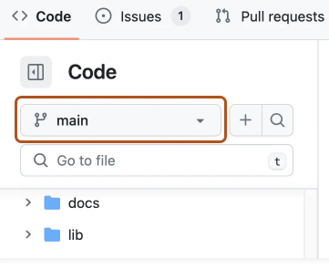

 - Optionally, if you want to create the new branch from a branch other than the default branch of the repository, click another branch, then select the branch dropdown menu again.

 - In the "Find or create a branch..." text field, type a unique name for your new branch, then click Create branch.
    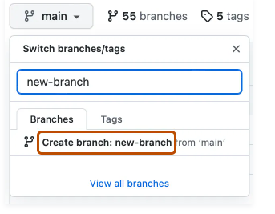

Making Changes to the Branch:

 - Modify files in your project as needed.
 - Stage the changes using the command below:

    git add .

 - Commit the change using the command below:

    git commit -m "Add new feature"

Pushing the Branch to GitHub:

 - Push the new branch to GitHub using the command below:

    git push origin new-feature

Creating a Pull Request:
 - Go to your repository on GitHub.
 - You will see a prompt to create a pull request for the new branch. Click on "Compare & pull request."
 - Add a title and description for your pull request and submit it for review.

Reviewing and Merging:
 - Collaborators can review the pull request, discuss changes, and suggest modifications.
 - Once approved, you can merge the branch into the main branch.
 - On the pull request page, click "Merge pull request" and then "Confirm merge."

Question 5: Pull Requests and Code Reviews:

A pull request in GitHub is a method for submitting contributions to a project. It facilitates collaboration by allowing developers to discuss changes before integrating them into the main codebase. When a pull request is opened, it provides a space for code review, discussion, and iteration on the proposed changes.

How Pull Requests Facilitate Code Reviews and Collaboration:

1. Code Review: 
    Pull requests enable team members to review the proposed changes, ensuring code quality and adherence to project standards before merging them into the main branch.

2. Discussion:
    They provide a platform for discussing specific code changes, suggesting improvements, and addressing potential issues.

3. Documentation:
    Pull requests keep a record of what changes were made, why they were made, and who reviewed them, which helps maintain a clear project history.

4. Continuous Integration:
    They can trigger automated tests and other CI workflows to ensure that changes do not break the existing codebase.

Steps to Create and Review a Pull Request:

1. Make Changes in a Branch:
    - First, create a new branch using the command below:

    git checkout -b feature-branch

    - Next and make your changes. Then afterwards commit them with the commands below:

    git add .
    git commit -m "Add new feature"
    git push origin feature-branch

2. Open a Pull Request:

    - Go to your repository on GitHub.
    - Click on the "Pull requests" tab.
    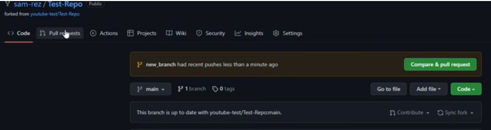

    - Click the "New pull request" button.
    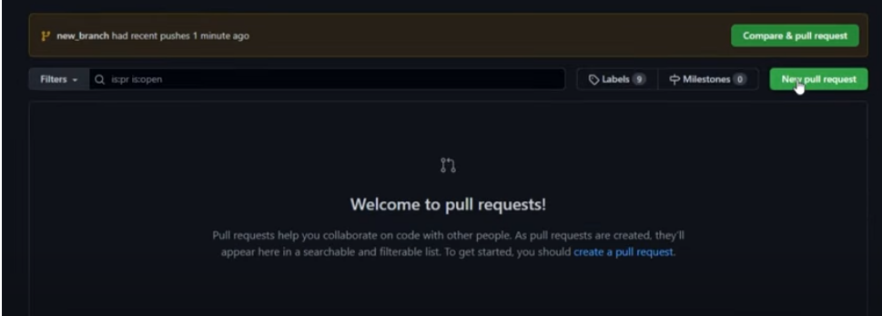
	
3. Select Branches:

    - Select the branch you want to merge from (e.g., feature-branch) and the branch you want to merge into (e.g., main).
    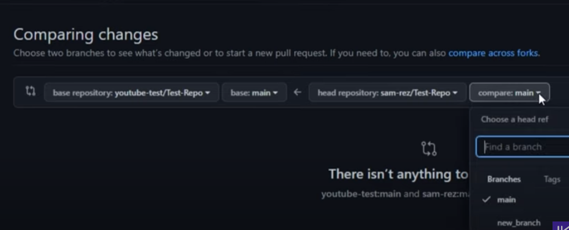

    - Fill in Details: Add a title and description for your pull request. Provide a clear explanation of what changes were made and why.

    - Create the Pull Request: Click the "Create pull request" button.

    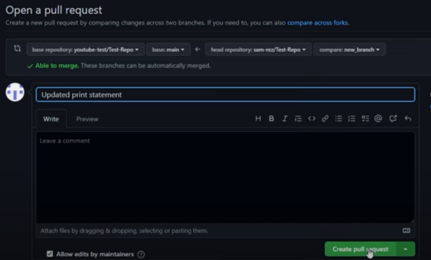

Reviewing a Pull Request:

1. Open the Pull Request:
    - Go to the "Pull requests" tab in your repository.
    - Click on the pull request you want to review.

2. Review Changes:
    - You can see the changes made in the "Files changed" tab.
    - Add comments by clicking on the line number where you want to comment.

3. Approve or Request Changes:

    - Once you have reviewed the changes, you can either approve the pull request or request changes.
    - Click on the "Review changes" button.

4. Merge the Pull Request:
    - If the changes are approved, click the "Merge pull request" button.
    - Confirm the merge by clicking the "Confirm merge" button.

Question 6: GitHub Actions:

GitHub Actions is a powerful feature that enables automation of workflows directly within a GitHub repository. It allows developers to automate repetitive tasks, run tests, deploy applications, and much more. The workflows are defined in YAML files stored in the repository, enabling version-controlled automation.

Key Features of GitHub Actions:

1. Automation: Automate tasks like building, testing, and deploying code.
2. Integration: Integrate with other services and APIs to extend functionality.
3. Customization: Create custom workflows tailored to specific project needs.
4. Concurrent Jobs: Run multiple jobs concurrently to speed up processes.
5. Event-Driven: Trigger workflows based on events such as push, pull request, and release.

Explanation of the Workflow
1. Trigger Events:
- The workflow triggers on push and pull_request events to the main branch.

2. Job Configuration:
- The jobs section defines a single job named build that runs on the latest Ubuntu runner.

3. Steps in the Job:
- Checkout Code: Uses the actions/checkout action to checkout the repository code.
- Set up Node.js: Sets up Node.js environment using the actions/setup-node action.
- Install Dependencies: Runs npm install to install project dependencies.
- Run Tests: Executes npm test to run the project's tests.
- Build Project: Runs npm run build to build the project.
- Deploy: Uses the peaceiris/actions-gh-pages action to deploy the built project to GitHub Pages.

An example of  a simple CI/CD pipeline using GitHub Actions: Deploying a Static Site

Let’s say you have a static website and you want to automate its deployment to GitHub Pages. You would follow these steps:

1. Create Repository:
- Create a repository named my-static-site.

2. Add Workflow File:
Create the .github/workflows/deploy.yml file with the following content:

name: Deploy Static Site

on:
  push:
    branches:
      - main

jobs:
  deploy:
    runs-on: ubuntu-latest

    steps:
    - name: Checkout code
      uses: actions/checkout@v2

    - name: Build and Deploy
      run: |
        echo "<h1>Hello, World!</h1>" > index.html
        git config --global user.name "github-actions"
        git config --global user.email "github-actions@github.com"
        git add index.html
        git commit -m "Deploy static site"
        git push origin main

3. Push Changes:
- Commit and push your changes to the main branch. The workflow will automatically run and deploy your static site to GitHub Pages.

QUESTION 7: Introduction to Visual Studio:

Visual Studio and Visual Studio Code (VS Code) are two popular development tools from Microsoft, each catering to different development needs. Below, we’ll explore their key features and differences.
Visual Studio: is an Integrated Development Environment (IDE). It’s a comprehensive IDE designed for larger-scale software development projects. It supports a wide range of programming languages and development platforms. Here are its key features:

1. Integrated Development Environment:

 - Provides a robust environment for developing applications, including tools for debugging, testing, and version control integration.
 - Supports multiple programming languages such as C#, C++, VB.NET, Python, and more.

2. Advanced Debugging and Diagnostics:

 - Powerful debugging tools with breakpoints, watch variables, and a rich visual interface for inspecting the state of an application.
 - Integrated profiling tools to analyze performance and diagnose issues.

3. Team Collaboration:
 - Integration with Azure DevOps and GitHub for source control, work item tracking, and continuous integration/continuous deployment (CI/CD) pipelines.
 - Code review tools and pull request management.

4. Comprehensive Tools for Different Development Needs:
 - Specialized tools for web development, desktop applications, cloud services, and more.
 - Includes designers for UI development, such as WinForms, WPF, and ASP.NET.

5. Extensive Extensions and Customization:
 - Supports a wide array of extensions to enhance functionality.
 - Customizable environment to suit different workflows.

Visual Studio Code: this is a Lightweight Source Code Editor. Visual Studio Code (VS Code) is a lightweight, fast, and flexible source code editor. It’s highly extensible and is suitable for quick development tasks and projects of varying sizes. Key features include:

1. Lightweight and Fast:
 - Designed to be a quick and responsive code editor.
 - Suitable for various programming languages and development tasks with a smaller footprint compared to full IDEs.

2. Integrated Terminal:
- Built-in terminal for running commands and scripts directly within the editor.
- Supports multiple shells like Bash, PowerShell, and Command Prompt.

3. Extensions and Customization:
- Vast marketplace for extensions to add language support, themes, debuggers, and tools for different frameworks.
- Highly customizable settings and keyboard shortcuts.

4. Source Control Integration:
- Native Git integration for version control.
- Support for other version control systems through extensions.

5. IntelliSense and Code Navigation:
- Intelligent code completion, parameter info, and quick info for various programming languages.
- Easy navigation with features like Go to Definition, Find All References, and symbol search.

Key Differences Between Visual Studio and Visual Studio Code:

Visual Studio is ideal for large-scale, complex development projects requiring comprehensive tools and advanced debugging capabilities. It’s heavier, requires more resources and  supports many languages, including .NET, C++, Python. Visual Studio Code, on the other hand, is perfect for developers who need a fast, flexible, and highly customizable code editor for quick development tasks and smaller projects. This code editor is lightweight, faster to start using and supports many languages through extensions.

QUESTION 8: Integrating GitHub with Visual Studio

Integrating a GitHub repository with Visual Studio allows developers to manage their source code, track changes, collaborate with team members, and automate CI/CD processes seamlessly. Below are detailed steps to integrate a GitHub repository with Visual Studio, along with explanations of how this integration enhances the development workflow.

Steps to Integrate a GitHub Repository with Visual Studio
1. Install GitHub Extension for Visual Studio
 - Open Visual Studio.
 - Go to Extensions > Manage Extensions.
 - Search for "GitHub Extension for Visual Studio".
 - Click Download and follow the prompts to install the extension.
 - Restart Visual Studio if prompted.

2. Authenticate to GitHub
 - Open Visual Studio and navigate to View > Team Explorer.
 - In Team Explorer, click on the Connect icon.
 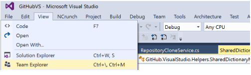
 - Under Local Git Repositories, click on Clone and then click Manage Connections.
 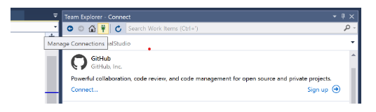
 - Select Connect to GitHub.
 - Enter your GitHub credentials or use an access token to authenticate.
 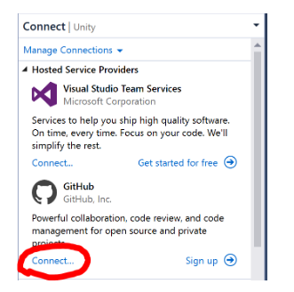

How integrating Visual Studio with GitHub enhances the development workflow:
1. Version Control Integration
Seamless Source Control: Visual Studio’s integration with GitHub allows developers to commit, push, pull, and sync changes directly within the IDE, reducing context switching and streamlining the version control process.
Branch Management: Easily create, manage, and switch between branches to isolate features, fixes, and experiments, enabling better workflow organization and parallel development.
2. Collaboration and Code Reviews
Pull Requests: Create and manage pull requests directly from Visual Studio, facilitating code reviews and discussions. This helps maintain code quality and ensures collaborative decision-making.
Issue Tracking: Link commits and branches to GitHub issues to keep track of tasks and progress, enhancing project management and accountability.
3. Continuous Integration/Continuous Deployment (CI/CD)
GitHub Actions: Automate workflows such as building, testing, and deploying code with GitHub Actions. Visual Studio provides tools to set up and manage these actions, integrating CI/CD into the development process.
4. Enhanced Code Quality and Debugging
Integrated Tools: Utilize Visual Studio’s robust debugging and code analysis tools to catch errors early and maintain high code quality.
Live Share: Collaborate in real-time with Live Share, allowing team members to edit and debug together, enhancing productivity and knowledge sharing.
5. Documentation and Knowledge Sharing
Wiki and README Files: Maintain project documentation using GitHub’s wiki and README files. Visual Studio’s markdown editor makes it easy to write and update documentation, ensuring that team members have access to the latest information.

QUESTION 9: Debugging in Visual Studio:

Visual Studio offers a comprehensive set of debugging tools that enhance the developer's ability to diagnose and resolve problems efficiently. Below, are some key debugging tools available in Visual Studio and how developers can use them effectively:

Key Debugging Tools in Visual Studio
1. Breakpoints
- Purpose: Breakpoints allow developers to pause the execution of their program at specific points to examine the state of the application.
- Usage: To set a breakpoint, click in the left margin next to the line of code where you want the execution to pause, or press F9.
- Example: If you suspect an issue in a loop, set breakpoints at the beginning and end of the loop to inspect variable values during iteration.

2. Watch Window:
- Purpose: The Watch window allows developers to monitor the values of variables and expressions as the program executes.
- Usage: Right-click on a variable and select Add Watch, or add variables manually in the Watch window.
- Example: Use the Watch window to track the value of a counter variable to ensure it changes as expected during loops.

3. Immediate Window
- Purpose: The Immediate window enables developers to evaluate expressions and execute statements at runtime.
- Usage: Open the Immediate window from Debug > Windows > Immediate, or press Ctrl+Alt+I.
- Example: Test a function with different inputs without modifying the code by typing the function call in the Immediate window.

4. Call Stack
- Purpose: The Call Stack window shows the sequence of function calls that led to the current execution point.
- Usage: Open the Call Stack window from Debug > Windows > Call Stack.
- Example: Use the Call Stack to trace the path of execution when an exception occurs, helping to identify the root cause.

5. Locals and Autos Windows
- Purpose: These windows display the variables in the current scope (Locals) and the variables used in the current and previous statements (Autos).
- Usage: Open from Debug > Windows > Locals or Autos.
- Example: Inspect variables automatically relevant to the current context to quickly identify unexpected values.

6. Exception Settings
- Purpose: Manage how exceptions are handled during debugging.
- Usage: Open the Exception Settings window from Debug > Windows > Exception Settings.
- Example: Configure Visual Studio to break execution when a specific exception type is thrown to diagnose the cause of the exception.

Here is how developers can use debugging tools to identify and fix issues:

1. Set Breakpoints: Start by setting breakpoints at critical points in your code, such as the start of a function or inside a loop.

2. Run in Debug Mode: Start debugging by pressing F5 or selecting Debug > Start Debugging. The program will run until it hits the first breakpoint.

3. Inspect Variables: Use the Locals and Watch windows to inspect the values of variables at the breakpoint. This helps to verify if the variables contain the expected values.

4. Step Through Code: Use F10 (Step Over) and F11 (Step Into) to execute the code line by line. This helps to observe the flow of execution and how the state changes with each line.

5. Evaluate Expressions: Use the Immediate window to test expressions or call functions on the fly. This is useful for checking the output of functions without changing the code.

6. Analyze Call Stack: If an exception occurs, use the Call Stack window to trace the sequence of function calls that led to the error. This can help to pinpoint where the issue originated.

7. Handle Exceptions: Configure exception settings to catch specific exceptions, allowing you to understand why and where they occur.

REFERENCES:

GitHub Docs. (n.d). About Git. Retrieved June 19, 2024, from https://docs.github.com/en/get-started/using-git/about-git
EverHour. (n.d). What is GitHub? Transforming how Developers Collaborate. Retrieved June 19, 2024, from https://everhour.com/blog/what-is-github/

Juviler J.  (2024, April 1). What is GitHub?(And What is It Used For?). HubSpot.Retrieved June 19, 2024, from https://blog.hubspot.com/website/what-is-github-used-for

PurpleBox. (2023, December 26). Collaborative GitHub Development for Beginners. Retrieved June 19 2024, from https://www.prplbx.com/resources/blog/collaborative-github-development-for-beginners/

Modelo.(2024, May 23). The Power of GitHub in Collaborative Software Development.  Retrieved June 19 2024, from https://www.modelo.io/damf/article/2024/05/23/0023/the-power-of-github-in-collaborative-software-development?hl=en

West D.(2023, April 14). Why GitHub is Essential for Collaborative Software Development. Retrieved June 19 2024, from https://www.jbinternational.co.uk/article/view/1368

Amarasekera I. (2024, April 14). Collaborative Software Development with Git and GitHub.  Retrieved June 19 2024, from https://medium.com/@iamarasekera/collaborative-software-development-with-git-and-github-8395794f84e0

GitHub Docs. (n.d). Creating a new Repository. Retrieved June 19, 2024, from https://docs.github.com/en/repositories/creating-and-managing-repositories/creating-a-new-repository

McKay J. (n.d). The three essential files required by every Git Repository. Retrieved June 19, from https://jamesmckay.net/2016/03/the-three-essential-files-required-by-every-git-repository

GeeksforGeeks. (n.d). What Is a GIT Repository?. Retrieved June 19, from https://www.geeksforgeeks.org/what-is-a-git-repository/

GeeksforGeeks. (n.d). How GIT Version Control Works?. Retrieved June 19, from https://www.geeksforgeeks.org/how-git-version-control-works/

GIT. (n.d). GIT - About Version Control. Retrieved June 19, from https://git-scm.com/book/en/v2/Getting-Started-About-Version-Control

Saloman J. (2023, October 25). A Comprehensive Guide to Version Control with Git and GitHub. Retrieved June 19, from https://dev.to/saloman_james/a-comprehensive-guide-to-version-control-with-git-and-github-3m0n

Brown J. (2023, August 16). Git Branching and Merging: A Step by Step Guide. Retrieved June 20, from https://www.varonis.com/blog/git-branching

GitHub Docs. (n.d). Creating and deleting branches within your repository. Retrieved June 20, 2024, from https://docs.github.com/en/pull-requests/collaborating-with-pull-requests/proposing-changes-to-your-work-with-pull-requests/creating-and-deleting-branches-within-your-repository

Keep On Coding.  (2022, August 29). How To Pull Request in 3 minutes [YouTube Channel]. YouTube . Retrieved June 20, 2024 from    https://www.youtube.com/watch?v=jRLGobWwA3Y

GitHub Docs. (n.d). Creating a pull request. Retrieved June 20, 2024, from https://docs.github.com/en/pull-requests/collaborating-with-pull-requests/proposing-changes-to-your-work-with-pull-requests/creating-a-pull-request

GitHub Docs. (n.d). About pull requests. Retrieved June 20, 2024, from https://docs.github.com/en/pull-requests/collaborating-with-pull-requests/proposing-changes-to-your-work-with-pull-requests/about-pull-requests

Morina F. (2022, December 1). Benefits of Using Pull Requests for Collaboration and Code Review. Retrieved June 20, from https://dev.to/saloman_james/a-comprehensive-guide-to-version-control-with-git-and-github-3m0n

GitHub Docs. (n.d). Automating Projects Using GitHub Actions. Retrieved June 20, 2024, from https://docs.github.com/en/issues/planning-and-tracking-with-projects/automating-your-project/automating-projects-using-actions

Pathirage G. (2024, February 4). Step in to CI/CD: A Hands on Guide to Building CI/CD Pipeline with GitHub Actions. Retrieved June 20, from https://medium.com/@pathirage/step-in-to-ci-cd-a-hands-on-guide-to-building-ci-cd-pipeline-with-github-actions-7490d6f7d8ff
Singh P. (2023, September 5). GitHub Actions: Automate Your Workflow[Beginners Guide]. Retrieved June 20, from https://www.knowledgehut.com/blog/web-development/using-github-actions-for-automation

GeeksforGeeks. (n.d). Introduction to Visual Studio. Retrieved June 20, from https://www.geeksforgeeks.org/introduction-to-visual-studio/

Turing. (n.d). Visual Studio vs Visual Studio Code - What’s best in 2024?. Retrieved June 20, from https://www.turing.com/kb/ultimate-guide-visual-studio-vs-visual-studio-code

Quoy L. (2024, February 7). Visual Studio vs Visual Studio Code: Main Differences. Retrieved June 20, from https://distantjob.com/blog/visual-studio-vs-visual-studio-code/#:~:text=The%20main%20difference%20between%20Visual,an%20Extension%2Dbased%20Code%20Editor.&text=It%20only%20needs%20a%20little%20space%20to%20run.

Chandrakar S.(2023, September 12). GitHub and VScode Integration.Retrieved June 20, 2024, from https://suyashchandrakar.hashnode.dev/streamline-your-development-workflow-with-github-and-visual-studio-code-integration

Learn Microsoft. (n.d). Debugging Techniques and Tools - Visual Studio(Windows). Retrieved June 20, from https://learn.microsoft.com/en-us/visualstudio/debugger/write-better-code-with-visual-studio?view=vs-2022

Learn Microsoft. (n.d). Debugging Code for Absolute Beginners - Visual Studio(Windows). Retrieved June 20, from https://learn.microsoft.com/en-us/visualstudio/debugger/debugging-absolute-beginners?view=vs-2022&tabs=csharp

Kant S.(2016, March 3). Debugging Tools in Visual Studio Code.Retrieved June 20, 2024, from https://www.c-sharpcorner.com/article/debugging-tools-in-visual-studio/

